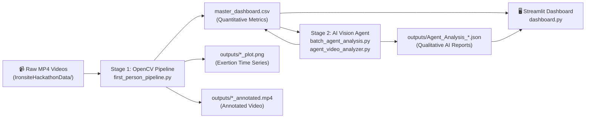

# IronSite BuilderBobs — Implementation Plan

Analyze first-person (POV) body-camera footage from construction workers, combining deterministic computer vision with AI vision language models to produce a unified productivity and efficiency dashboard for supervisors.

## Architecture Overview



## Proposed Changes

---

### Stage 1 — OpenCV Quantitative Pipeline

#### [MODIFY] [first_person_pipeline.py](file:///mnt/d/Projects/Hackathon21Feb20226/first_person_pipeline.py)

Batch-processes all `.mp4` files from `IronsiteHackathonData/`. For each video:
- **Downsamples** to 5 FPS (from 30 FPS) for 6× speed boost with minimal information loss
- **MediaPipe HandLandmarker** tracks wrist (x, y) pixel coordinates each frame
- **YOLOv8 Construction Model** (`yolov8n-construction.pt`) detects site objects (hard hats, tools, materials)
- **Activity classification**: worker marked "active" if `smoothed_exertion > 5px` AND objects detected
- **Outputs per video**: annotated MP4, `_data.csv`, `_plot.png`
- **Aggregates** to `master_dashboard.csv` with: `Video`, `Total Frames`, `Working Frames`, `Productivity %`, `Peak Exertion (px)`, `Detected Task`

Key algorithmic choice — **Global Optical Flow** (via `apply_global_motion.py`) was used to compensate for camera shake inherent in body-cam footage, ensuring motion measured is worker hand movement, not ambient camera tremor.

---

### Stage 2 — AI Qualitative Vision Agent

#### [MODIFY] [agent_video_analyzer.py](file:///mnt/d/Projects/Hackathon21Feb20226/agent_video_analyzer.py)

Pivoted from Gemini API (rate-limited) → **Ollama LLaVA** running on a remote Vast.ai GPU instance, tunnelled via SSH:

```bash
ssh -p 56834 root@171.248.243.88 -L 8080:localhost:11434
```

For each video:
1. Reads `master_dashboard.csv` to load the OpenCV quantitative metrics for context
2. Extracts **16 evenly-spaced frames** via `ffmpeg` subprocess
3. Encodes frames as `base64` and sends to `POST /api/generate` on the Ollama endpoint
4. Prompts LLaVA with the OpenCV metrics + frame images, requesting structured JSON
5. Parses and saves `outputs/Agent_Analysis_{video}.json`
6. Back-fills `master_dashboard.csv` with five new AI columns

**AI Columns Added to CSV:**

| Column | Description |
|--------|-------------|
| `AI_Trade` | Primary trade identified (e.g., Plumber, Mason) |
| `AI_Tasks` | Specific tasks observed |
| `AI_Output` | Quantified output (e.g., "5 joints welded") |
| `AI_UES` | Universal Efficiency Score (1–100 integer) |
| `AI_Summary` | 2-sentence qualitative performance summary |

#### [MODIFY] [batch_agent_analysis.py](file:///mnt/d/Projects/Hackathon21Feb20226/batch_agent_analysis.py)

Orchestrates `agent_video_analyzer.analyze_video()` across all 14 videos sequentially with error handling and a 5s inter-video sleep.

---

### Dashboard & Deployment

#### [MODIFY] [dashboard.py](file:///mnt/d/Projects/Hackathon21Feb20226/dashboard.py)

Enhanced Streamlit dashboard with:
- **5 site-wide KPI metrics** at top
- **Altair grouped bar chart**: Productivity % vs AI UES per video
- **Altair bar chart**: Peak Exertion Intensity by video
- **Altair donut chart**: Trade breakdown by count
- **Leaderboard table** with ProgressColumn for Productivity & UES
- **Drill-down view**: per-video AI summary, tasks, output, JSON expander, exertion plot, annotated video

#### [NEW] [requirements.txt](file:///mnt/d/Projects/Hackathon21Feb20226/requirements.txt)

Pinned dependency file for Streamlit Community Cloud deployment.

#### [MODIFY] [.gitignore](file:///mnt/d/Projects/Hackathon21Feb20226/.gitignore)

Unblocked `master_dashboard.csv`, `outputs/`, `.png` to allow deployment data to be committed to GitHub.

---

## Verification Plan

### Automated Tests
```bash
# 1. Confirm Ollama tunnel is reachable
curl http://localhost:11434/api/tags

# 2. Single video smoke test
python3 agent_video_analyzer.py IronsiteHackathonData/14_production_mp.mp4

# 3. Full batch run
python3 batch_agent_analysis.py

# 4. Validate all 14 JSON outputs exist
ls outputs/Agent_Analysis_*.json | wc -l   # expect: 14

# 5. Validate CSV has AI columns
python3 -c "import pandas as pd; df = pd.read_csv('master_dashboard.csv'); print(df[['Video','AI_Trade','AI_UES']].to_string())"
```

### Manual Verification
- Launch `streamlit run dashboard.py` and confirm charts render with real data
- Check drill-down view shows AI summary and exertion plot for each video
- Verify Streamlit Community Cloud deployment at `share.streamlit.io`
