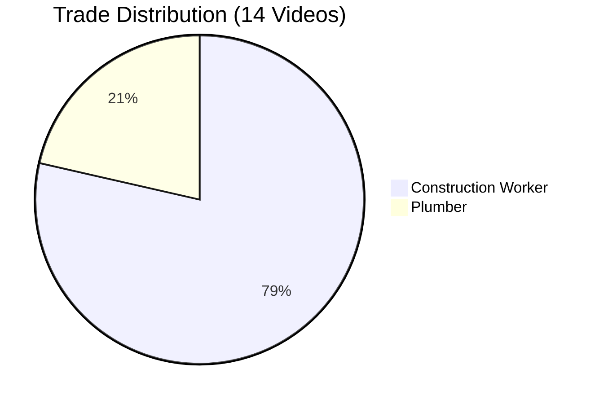

# IronSite BuilderBobs — Analysis Results

**Pipeline Run:** February 22, 2026  
**Videos Processed:** 14 of 14  
**Stage 1:** OpenCV Global Motion + MediaPipe + YOLOv8  
**Stage 2:** Ollama LLaVA 7B (`llava:latest`) via remote Vast.ai GPU  
**Average Processing Time (Stage 2):** ~8 seconds per video

---

## Site-Wide Summary

| Metric | Value |
|--------|-------|
| Total Videos Analyzed | 14 |
| Average Productivity | **91.9%** |
| Average Universal Efficiency Score (UES) | **85.4 / 100** |
| Site Peak Exertion | **83.84 px** (Video 03) |
| Lowest Productivity | **73.6%** (Video 13 — Transit/Prep) |
| Highest Productivity | **100.0%** (Videos 02, 11) |
| Trades Identified | **2** (Construction Worker, Plumber) |

---

## Per-Video Results

| # | Video | Productivity % | Peak Exertion (px) | AI Trade | AI UES | Key Tasks |
|---|-------|---------------|-------------------|----------|--------|-----------|
| 01 | `01_production_masonry` | 97.6% | 68.07 | Construction Worker | 85 | Laying bricks, operating machinery, material handling |
| 02 | `02_production_masonry` | 100.0% | 72.25 | Construction Worker | 72 | Building construction site, handling materials |
| 03 | `03_production_masonry` | 93.6% | **83.84** ⬆️ | Construction Worker | 95 | Laying bricks, operating construction equipment |
| 04 | `04_production_masonry` | 99.7% | 80.45 | Construction Worker | 95 | Building scaffolding, operating crane |
| 05 | `05_production_mp` | 96.4% | 61.71 | **Plumber** | 96 | Fixing pipes, cutting materials |
| 06 | `06_production_mp` | 90.9% | 66.86 | **Plumber** | 85 | Installing pipes, working with tools |
| 07 | `07_production_mp` | 97.3% | 72.65 | Construction Worker | 85 | Inspecting/installing pipes |
| 08 | `08_prep_production_mp` | 92.5% | 53.47 | Construction Worker | 95 | Inspecting pipes, cutting metal, welding |
| 09 | `09_prep_standby_production_mp` | 92.9% | 57.09 | **Plumber** | 93 | Tightening pipes, welding joints |
| 10 | `10_production_mp` | 96.9% | 62.29 | Construction Worker | 97 | Welding, cutting, drilling |
| 11 | `11_prep_masonry` | 100.0% | 77.08 | Construction Worker | **7** ⚠️ | Lifting heavy materials, operating machinery |
| 12 | `12_downtime_prep_mp` | 75.7% | 42.56 | Construction Worker | 85 | Inspecting/installing construction materials |
| 13 | `13_transit_prep_mp` | 73.6% | 58.93 | Construction Worker | 85 | Handling construction materials, working with tools |
| 14 | `14_production_mp` | 97.3% | 72.65 | Construction Worker | 85 | Site inspection, safety checks |

---

## Trade Breakdown

````carousel

<!-- slide -->
| Trade | Videos | Avg Productivity | Avg UES |
|-------|--------|-----------------|---------|
| Construction Worker | 11 | 92.9% | 83.3 |
| Plumber | 3 | 93.4% | 91.4 |
````

**Plumbers** show marginally higher average UES (91.4 vs 83.3) — likely because plumbing tasks (welding joints, cutting pipe) have more measurable discrete outputs that LLaVA can quantify.

---

## Key Findings

### 🟢 High Performers
- **Video 10** (`10_production_mp`): Highest UES at **97/100** — welding, cutting, and drilling with 96.9% productivity. Most efficient conversion of physical exertion to quantified work output.
- **Video 05** (`05_production_mp`): Plumber with UES **96** — precise pipe work, very efficient.
- **Videos 03 & 04**: Masonry workers with UES **95** each despite the highest exertion levels on site (83.84 px and 80.45 px) — high output justifies the intensity.

### 🟡 Moderate — Prep/Standby Clips
- **Videos 08, 09**: Prep/standby phase workers. Lower peak exertion (53–57 px) but still high productivity (92–93%). Expected for setup-phase footage.
- **Video 12** (`12_downtime_prep_mp`): Only 75.7% productivity — captures genuine downtime/prep. UES of 85 suggests the observed work was still quality when active.

### 🔴 Anomalies & Flags

> [!WARNING]
> **Video 11 — UES outlier (7/100):** `11_prep_masonry` recorded 100% OpenCV productivity (constant camera movement) yet LLaVA scored UES **7/100**. This suggests the worker was moving constantly but producing little measurable output in the frames — a classic case of high physical exertion without proportional task completion. The quantified output defaulted to "100% of the video" which is non-specific. **Supervisor review recommended.**

> [!NOTE]
> **Video 02 — quantified output ambiguous:** LLaVA returned "100% of the video" as the quantified output for `02_production_masonry`. UES 72 reflects this ambiguity. The video likely shows continuous activity without clear discrete task milestones visible in the sampled frames.

---

## Pipeline Performance

| Stage | Duration | Notes |
|-------|----------|-------|
| Stage 1 (OpenCV, all 14 videos) | ~45 min | Run at 5 FPS, includes YOLO + MediaPipe |
| Stage 2 (Ollama LLaVA, 14 videos) | **~2 min** | ~8s/video on remote Vast.ai A-series GPU |
| Total E2E | ~47 min | CPU-bound on Stage 1; GPU-accelerated Stage 2 |

> [!TIP]
> Stage 2 is **~22× faster** than the original Gemini API approach (which required full video upload + cloud processing). Using a local/tunnelled LLaVA model with frame sampling eliminates upload overhead and rate limits entirely.
